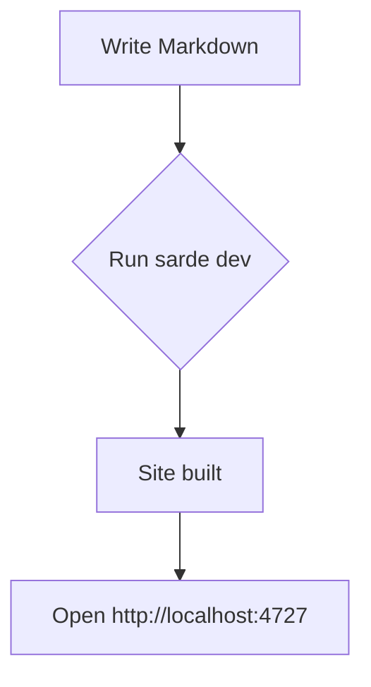
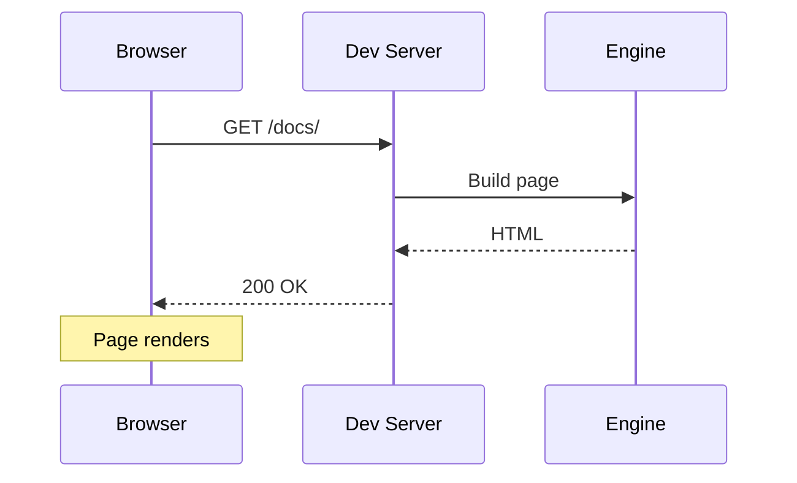
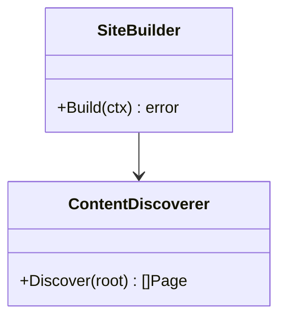

Mermaid renders diagrams from text definitions inside fenced code blocks tagged with `mermaid`. Flowcharts, sequence diagrams, class diagrams, Gantt charts, and more are supported. Mermaid.js is loaded on-demand — only pages containing a mermaid block load the library.

## Flowchart

````md

````


## Sequence Diagram

````md

````


## Class Diagram

````md

````


For the full syntax reference and all supported diagram types, see the [Mermaid documentation](https://mermaid.js.org/intro/).
