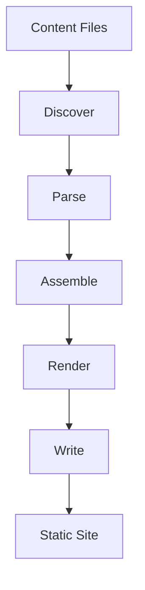
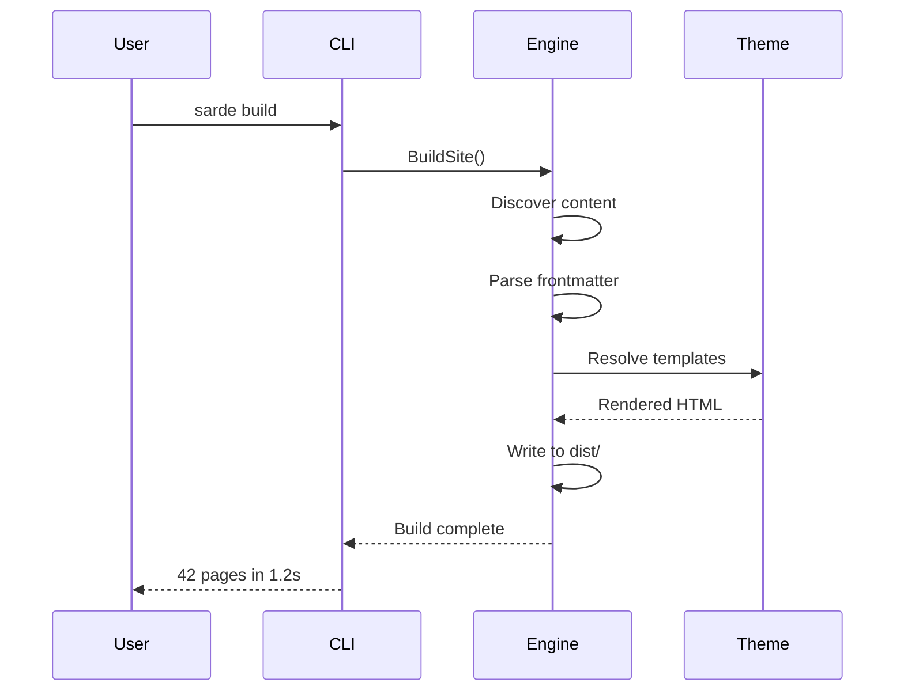

This page renders every custom extension provided by Sarde in one place. It is a visual reference, not a tutorial. For usage details, see the individual extension pages in the sidebar.

---

## Inline Extensions

### Highlight

Use `==text==` to ==highlight a word or phrase== inline.

### Spoiler

Use `||text||` to hide content until hovered or clicked. The answer is ||42||.

### Keyboard Keys

Default: ::kbd[Ctrl+Shift+P] | Small: ::kbd[Ctrl+S](size="sm") | Large: ::kbd[Ctrl+S](size="lg")

Wide keys: ::kbd[Space](wide) ::kbd[Enter](wide) ::kbd[Backspace](wide)

Combined: ::kbd[Space](size="lg" wide) ::kbd[Tab](size="sm" wide)

Special keys: ::kbd[Esc] ::kbd[Tab] ::kbd[⇧] ::kbd[⌘] ::kbd[⌥] ::kbd[⌃] ::kbd[↑] ::kbd[↓] ::kbd[←] ::kbd[→] ::kbd[Delete]

### Copy Text

Install with ::copy[go install github.com/getsarde/sarde@latest] and configure at ::copy[~/.config/sarde.yaml].

### Annotation

Highlight style: the ::annotation[virtual DOM](style="highlight" An in-memory representation of the real DOM tree, used for efficient diffing and minimal updates) pattern enables fast UI updates.

Plain style: check the ::annotation[SSR](style="plain" Server-Side Rendering generates HTML on the server instead of the client) configuration for production deployments.

### Icons

Lucide (default): :icon[rocket] :icon[star] :icon[heart] :icon[zap]

Tabler: :icon[tabler:brand-github] :icon[tabler:brand-discord]

Simple Icons: :icon[brands:go] :icon[brands:typescript] :icon[brands:python]

### Inline Math

Einstein's equation $E = mc^2$ and the quadratic formula $x = \frac{-b \pm \sqrt{b^2 - 4ac}}{2a}$.

---

## Block Extensions

### Asides

:::note
A **note** for supplementary information.
:::

:::tip[Helpful Tip]
A **tip** with a custom title. Tips highlight best practices or shortcuts.
:::

:::info
An **info** aside for neutral, informational callouts.
:::

:::warning
A **warning** about potential pitfalls.
:::

:::danger[Breaking Change]
A **danger** aside with a custom title. Use for critical warnings.
:::

:::caution
A **caution** aside for situations requiring extra care.
:::

:::important
An **important** aside for information the reader should not skip.
:::

:::success
A **success** aside confirming that a step completed correctly.
:::

#### GitHub-Flavored Asides

:::gh-note
GitHub-style note.
:::

:::gh-tip
GitHub-style tip.
:::

:::gh-important
GitHub-style important.
:::

:::gh-warning
GitHub-style warning.
:::

:::gh-caution
GitHub-style caution.
:::

#### Rich Content in Asides

:::tip[Asides Support Rich Content]
Asides can contain any markdown:

- Bullet lists
- **Bold** and *italic* text
- `Inline code` and ==highlights==

```go
fmt.Println("Code blocks work too")
```

> And blockquotes.
:::

---

### Badges

:::badge(type="success")
New
:::

:::badge(type="warning")
Deprecated
:::

:::badge(type="danger")
Removed
:::

:::badge(type="info")
Beta
:::

:::badge(type="default")
v2.0.0
:::

:::badge(type="caution")
Preview
:::

#### Outline Badges

:::badge(type="success" style="outline")
Stable
:::

:::badge(type="warning" style="outline")
Experimental
:::

:::badge(type="danger" style="outline")
Breaking
:::

#### Badge Sizes

:::badge(type="success" size="sm")
Small
:::

:::badge(type="success")
Default
:::

:::badge(type="success" size="lg")
Large
:::

#### Badge without Icon

:::badge(type="success" no-icon="true")
No Icon
:::

#### Badge Group

:::badge-group
:::badge(type="success" size="sm")
GET
:::
:::badge(type="info" size="sm")
/api/users
:::
:::badge(type="warning" size="sm")
Auth Required
:::
:::

---

### Details

:::details[Click to expand]
Hidden content with any markdown: lists, **formatting**, and code blocks.

```yaml
site:
  title: "My Site"
```
:::

:::details[Expanded by default](open)
This details block starts open.
:::

---

### Accordion

Default (exclusive, one open at a time):

:::accordion
:::details[What is Sarde?]
A zero-config, Go-based static site generator.
:::
:::details[How do I install it?]
Run ::copy[go install github.com/getsarde/sarde@latest] to install.
:::
:::details[Is it extensible?]
Yes, with a plugin system offering four lifecycle hooks.
:::
:::

Independent (multiple open):

:::accordion(independent)
:::details[Item one]
This item can stay open independently of the others.
:::
:::details[Item two]
So can this one.
:::
:::

---

### Cards

:::card[Getting Started](icon="rocket")
Learn how to set up your first Sarde project in under five minutes.
:::

:::card[Highlighted Card](icon="star" variant="highlighted")
Use `variant="highlighted"` for an accent border.
:::

:::card[Subtle Card](icon="eye-off" variant="subtle")
Use `variant="subtle"` for a transparent background with a dashed border.
:::

#### Card Grid (auto columns)

:::card-grid
:::card[Fast Builds](icon="zap")
Parallel rendering and incremental builds.
:::
:::card[Zero Config](icon="package")
Drop Markdown files into `content/` and go.
:::
:::card[Extensible](icon="puzzle")
Four lifecycle hooks for plugins.
:::
:::card[Themeable](icon="palette")
Template overlay resolution at every level.
:::
:::

#### Card Grid (fixed 3 columns)

:::card-grid(cols="3")
:::card[Routes](icon="map")
URL routes with parameters and wildcards.
:::
:::card[Templates](icon="layout")
Go `html/template` with custom functions.
:::
:::card[Plugins](icon="plug")
Extend every stage of the build pipeline.
:::
:::

#### Card Grid (stagger)

:::card-grid(stagger)
:::card[Fast Builds](icon="zap")
Parallel rendering keeps builds under a second.
:::
:::card[Zero Config](icon="package")
Drop Markdown into `content/` and get a production site.
:::
:::card[Extensible](icon="puzzle")
Four lifecycle hooks for the build pipeline.
:::
:::card[Themeable](icon="palette")
Override any template at any level.
:::
:::

---

### Link Cards

:::link-card[Getting Started Guide](href="/docs/start-here/getting-started" icon="book-open")
Follow the step-by-step setup guide.
:::

#### External Link Card

:::link-card[GitHub Repository](href="https://github.com/getsarde/sarde" icon="github")
View the source code and contribute.
:::

#### Link Card with Image

:::link-card[Sarde Desktop](href="https://github.com/getsarde/sarde" image="https://placehold.co/240x160/1a1a2e/e0e0e0?text=Desktop+App")
A visual authoring environment powered by Tauri and Svelte.
:::

#### Tab Behavior Override

:::link-card[Internal (opens new tab)](href="/docs/start-here/getting-started" icon="download" new-tab="true")
This internal link opens in a new tab.
:::

:::link-card[External (same tab)](href="https://go.dev" icon="globe" new-tab="false")
This external link stays in the same tab.
:::

---

### Link Buttons

:::link-button[Primary](href="#" variant="primary" icon="arrow-right")
:::

:::link-button[Secondary](href="#" variant="secondary" icon="github")
:::

:::link-button[Minimal](href="#" variant="minimal")
:::

:::link-button[Ghost](href="#" variant="ghost" icon="eye")
:::

:::link-button[Outline](href="#" variant="outline" icon="square")
:::

#### Button Sizes

:::link-button[Small](href="#" variant="primary" size="sm")
:::

:::link-button[Default](href="#" variant="primary")
:::

:::link-button[Large](href="#" variant="primary" size="lg")
:::

#### Icon-Only Buttons

:::link-button(href="#" variant="primary" icon="heart")
:::

:::link-button(href="#" variant="secondary" icon="settings")
:::

:::link-button(href="#" variant="outline" icon="search")
:::

#### Block (Full Width)

:::link-button[Full Width Button](href="#" variant="primary" icon="arrow-right" block="true")
:::

#### Centered

:::link-button[Centered Button](href="#" variant="primary" center="true")
:::

#### Disabled

:::link-button[Disabled Primary](href="#" variant="primary" disabled="true")
:::

:::link-button[Disabled Secondary](href="#" variant="secondary" disabled="true")
:::

#### Button Group

:::link-button-group
:::link-button[Previous](href="#" variant="secondary" icon="arrow-left" iconPlacement="start")
:::
:::link-button[Next](href="#" variant="primary" icon="arrow-right")
:::
:::

---

### Columns

:::columns(cols="2")
:::column
### Left Column
Content on the left side. Columns collapse to a single column on small screens.
:::
:::column
### Right Column
Content on the right side. Each column can contain any markdown.
:::
:::

:::columns(cols="3")
:::column
**One**

First of three columns.
:::
:::column
**Two**

Second of three columns.
:::
:::column
**Three**

Third of three columns.
:::
:::

---

### Steps

:::steps
1. **Install Sarde.** Download the binary or install via your package manager.

2. **Create a project.** Run `sarde new my-site` to scaffold a new project.

3. **Add content.** Drop Markdown files into the `content/` directory.

4. **Start the dev server.** Run `sarde dev` and open `http://localhost:4727`.

5. **Build for production.** Run `sarde build` to generate the static site in `dist/`.
:::

#### Steps with Headings

:::steps
### Install dependencies

```bash
go install github.com/getsarde/sarde@latest
```

### Create your configuration

```yaml
site:
  title: "My Documentation"
  url: "https://docs.example.com"
```

### Write your first page

Create `content/docs/getting-started.md`. Sarde will auto-detect it as a docs collection page.

### Deploy

```bash
sarde build
```
:::

---

### Tabs

:::tabs
== npm

```bash
npm install -g sarde
```

== pnpm

```bash
pnpm add -g sarde
```

== yarn

```bash
yarn global add sarde
```

== Go

```bash
go install github.com/getsarde/sarde@latest
```
:::

#### Tabs with Icons

:::tabs
== JavaScript (icon="braces")

```js
console.log("Hello, world!");
```

== TypeScript (icon="file-code")

```ts
const greeting: string = "Hello, world!";
console.log(greeting);
```

== Python (icon="code")

```python
print("Hello, world!")
```

== Go (icon="terminal")

```go
fmt.Println("Hello, world!")
```
:::

---

### Code Group

:::code-group

```go
package main

import "fmt"

func main() {
    fmt.Println("Hello from Go")
}
```

```typescript
function main() {
    console.log("Hello from TypeScript");
}
```

```python
def main():
    print("Hello from Python")

main()
```

:::

---

### File Tree

:::file-tree
- my-site/
  - content/
    - icon:book-open docs/
      - icon:rocket getting-started.md
      - **configuration.md**
      - _index.md
    - icon:newspaper blog/
      - 2025-01-01-hello-world.md
      - _index.md
    - _index.md
  - icon:palette themes/
    - default/
      - layouts/
      - static/
      - ...
  - static/
    - images/
    - favicon.ico
  - icon:settings sarde.yaml  # Site configuration
  - icon:package package.json
:::

---

### Figure

:::figure[The Sarde build pipeline processes content through six stages]

:::

---

### Gallery

:::gallery[Screenshot Gallery]


:::

---

### Image Compare

:::image-compare[Before and After Optimization]


:::

---

### Video

:::video(src="https://www.youtube.com/watch?v=dQw4w9WgXcQ" title="Video Embed")
:::

#### 4:3 Aspect Ratio

:::video(src="https://www.youtube.com/watch?v=dQw4w9WgXcQ" ratio="4:3" title="4:3 format")
:::

#### Autoplay, Muted, Loop

:::video(src="https://www.youtube.com/watch?v=dQw4w9WgXcQ" autoplay muted loop)
:::

#### Vimeo

:::video(src="https://vimeo.com/148751763" title="Vimeo Showcase")
:::

---

### Timeline

:::timeline
== v2.0.0 (September 2025)
Major release: new engine, Goldmark extensions, Orama search, and the Tauri desktop app.

== v2.1.0 (December 2025)
Added collection versioning, tabbed docs, and the announcements plugin.

== v2.2.0 (February 2026)
Introduced the Python SDK, expanded i18n, and added content linting.

== v2.3.0 (April 2026)
Improved cold start times by 40% and added focus mode.

== v2.4.0 (June 2026)
Region-aware Realtime presence and the columns extension.
:::

#### Timeline with Headings

:::timeline
### Alpha
Opened to a small group of design partners.

### Beta
Public beta with production workloads.

### General Availability
Stable release with SLA guarantees.
:::

---

### Terminal

:::terminal
$ sarde new my-docs
Creating new project in ./my-docs...
  Created content/
  Created sarde.yaml
  Installed default theme
  Created content/_index.md
$ cd my-docs && sarde dev
Starting dev server...
  Discovered 1 page
  Built site in 12ms
  http://localhost:4727
:::

---

### Block Math

$$
\int_0^\infty e^{-x^2} \, dx = \frac{\sqrt{\pi}}{2}
$$

$$
\nabla \times \mathbf{E} = -\frac{\partial \mathbf{B}}{\partial t}
$$

$$
\sum_{n=1}^{\infty} \frac{1}{n^2} = \frac{\pi^2}{6}
$$

---

### Mermaid Diagrams





---

### Code Diff

```diff
- const config = loadConfig("config.json")
+ const config = loadConfig("sarde.yaml")
  
  func buildSite(cfg Config) error {
-     pages, err := discover(cfg.ContentDir)
+     pages, err := discoverParallel(cfg.ContentDir, cfg.Workers)
      if err != nil {
          return err
      }
  }
```

---

## Code Block Features

Titles, line numbers, and line annotations:

```go title="handler.go" showLineNumbers {2,4-6} ins={8} del={9} mark={1}
package main

import "fmt"

func greet(name string) string {
    return fmt.Sprintf("Hello, %s!", name)
}

func main() { greet("world") }
func main() { greet("Sarde") }
```

Focus and collapse:

```typescript title="config.ts" focus={2-4} collapse
export const config = {
  title: "My Site",
  description: "Built with Sarde",
  url: "https://example.com",
  theme: {
    preset: "ocean",
    dark: true,
  },
  build: {
    minify: true,
    parallel: true,
  },
};
```

Terminal chrome (applied automatically for bash, sh, zsh, powershell, cmd):

```bash
sarde build --minify
```

```powershell
sarde build --minify
```

---

## Combining Extensions

Extensions compose naturally. Here are some examples of nesting and mixing.

:::tip[Pro Tip: Combine Extensions]
You can use ==highlighted text==, ::kbd[keyboard keys], and `inline code` inside asides.

Math works too: $f(x) = x^2 + 1$.

The answer is ||hidden behind a spoiler||.
:::

:::details[Full Configuration Example]
:::tabs
== Minimal

```yaml
site:
  title: "My Site"
```

== Full

```yaml
site:
  title: "My Site"
  description: "A comprehensive documentation site"
  url: "https://example.com"
  language: "en"

build:
  minify: true

plugins:
  enabled:
    - search
    - seo
    - sitemap
```
:::
:::
