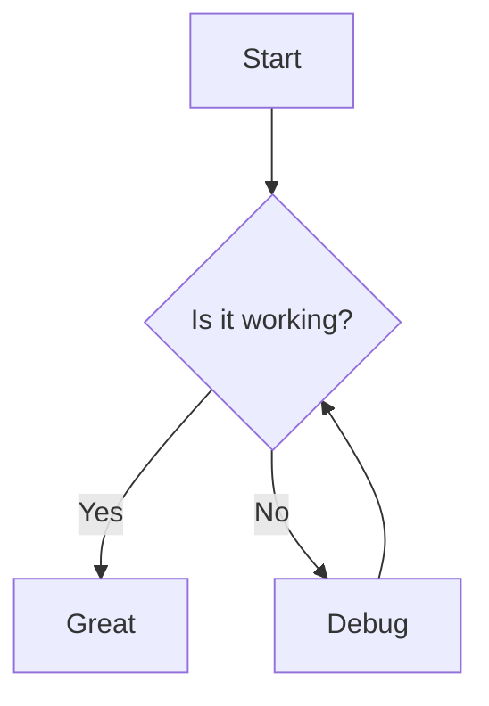
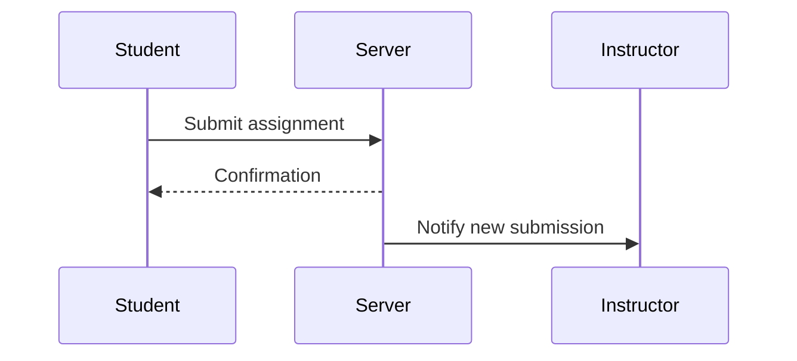
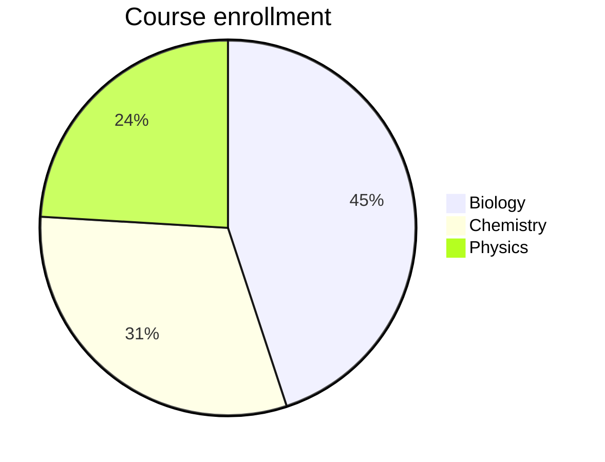

Mermaid diagrams render flowcharts, sequence diagrams, class diagrams, and other visualizations from text definitions. The diagram source is written in a fenced code block and rendered client-side by the Mermaid library.

## Basic syntax

Use a fenced code block with the `mermaid` language identifier:

````

````

→ A flowchart appears with boxes and arrows showing the decision flow.

<!-- SCREENSHOT: mermaid-flowchart — a simple flowchart with start, decision, and outcome nodes -->

## Supported diagram types

Mermaid supports many diagram types. Some commonly used ones:



→ A sequence diagram appears showing message flow between participants.



→ A pie chart appears with labeled segments.

For the full list of diagram types and syntax, see the [Mermaid documentation](https://mermaid.js.org/).

## How it works

The Mermaid extension uses an AST transformer (not a block parser). During Markdown parsing, it finds fenced code blocks with the `mermaid` or `sarde-mermaid` language identifier and replaces them with a `MermaidBlock` node. The renderer outputs a `<div class="sarde-mermaid">` containing the escaped diagram source.

The Mermaid plugin then detects `class="sarde-mermaid"` in the rendered HTML and injects the Mermaid runtime scripts. The client-side library parses the diagram source and replaces the text with an SVG.

## Configuration

The [Mermaid plugin](/plugins/mermaid/) is enabled by default. Remove `mermaid` from `plugins.enabled` in `sarde.yaml` to turn it off.

To force Mermaid assets on every page (useful when diagrams are loaded dynamically):

```yaml
plugins:
  config:
    mermaid:
      always: true
```

To disable Mermaid rendering entirely:

```yaml
markdown:
  mermaid: false
```

## Language identifier

Both `mermaid` and `sarde-mermaid` are accepted as the fenced code block language. The `sarde-mermaid` spelling is a legacy alias; prefer `mermaid`.

## Edge cases

- The diagram `<div>` has `role="img"` and `aria-label="Mermaid diagram"` for accessibility.
- Diagram source is HTML-escaped before being placed in the `<div>`. Special characters in labels and text are safe.
- Mermaid renders client-side. With JavaScript disabled, the raw diagram source text is visible.
- The Mermaid runtime scripts are only injected on pages that contain at least one diagram (unless `always: true` is set).
- Mermaid inherits the page's light/dark theme. The init script configures Mermaid to match the current `data-theme` attribute.

See the [Mermaid plugin](/plugins/mermaid) for runtime asset injection and configuration.
