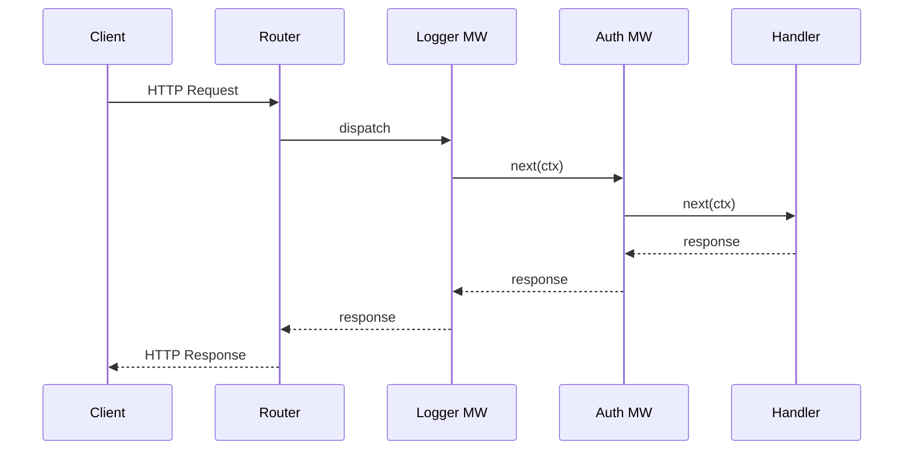

Middleware is the backbone of any serious Velox application. This guide covers practical patterns for writing reusable middleware.

## Performance Characteristics

The theoretical throughput of a middleware chain is $O(1)$ per request, since each middleware is a direct function call with no reflection or dynamic dispatch.

For a chain with $n$ middleware functions, the total overhead is:

$$
T_{total} = \sum_{i=1}^{n} T_{middleware_i} + T_{handler}
$$

In practice, each middleware adds approximately 5-15 nanoseconds of overhead.

## Request Flow



## Example: Rate Limiter

```go title="ratelimit.go"
func RateLimit(rps int) velox.Middleware {
    limiter := rate.NewLimiter(rate.Limit(rps), rps)
    return func(next velox.HandlerFunc) velox.HandlerFunc {
        return func(c *velox.Context) {
            if !limiter.Allow() {
                c.JSON(429, map[string]string{
                    "error": "rate limit exceeded",
                })
                return
            }
            next(c)
        }
    }
}
```
