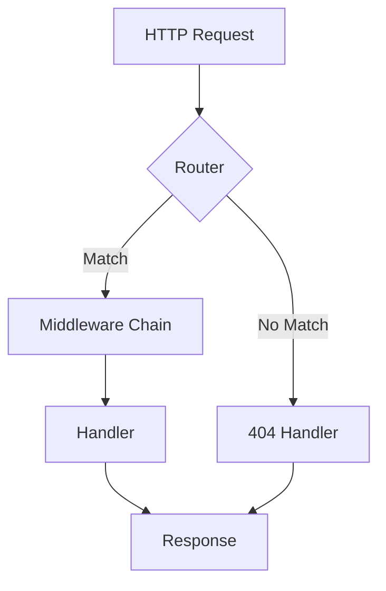
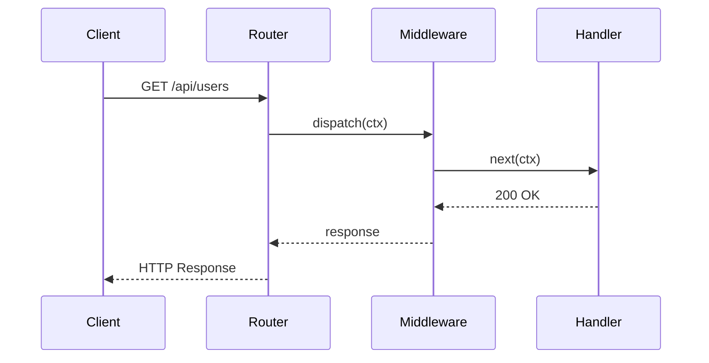

This page demonstrates every custom markdown extension available in Sarde.

## Aside / Callout Blocks

:::note
This is a default note aside.
:::

:::note[Custom Title]
A note with a custom title.
:::

:::tip
Use asides to highlight important information.
:::

:::info
Informational aside for supplementary context.
:::

:::warning
Proceed with caution when modifying configuration.
:::

:::danger
This action is irreversible and may cause data loss.
:::

:::caution
Deprecated feature — will be removed in v2.0.
:::

:::important
This is required for production deployments.
:::

## GitHub-Style Alerts

> [!NOTE]
> This is a GitHub-style note alert.

> [!TIP]
> A helpful tip using GitHub alert syntax.

> [!WARNING]
> Be careful with this approach in production.

## Steps (Heading Mode)

:::steps

### Install dependencies

Run the install command for your package manager.

### Configure the application

Edit `config.yaml` with your settings.

### Start the server

Run `go run main.go` to start.

:::

## Content Tabs

:::tabs

== Go

```go
r := velox.New()
r.GET("/", handler)
r.Listen(":8080")
```

== Python

```python
from flask import Flask
app = Flask(__name__)

@app.route("/")
def handler():
    return "Hello!"
```

== JavaScript

```js
const express = require("express");
const app = express();

app.get("/", (req, res) => {
  res.send("Hello!");
});

app.listen(8080);
```

:::

## Code Groups

:::code-group

```bash title="npm"
npm install velox-client
```

```bash title="yarn"
yarn add velox-client
```

```bash title="pnpm"
pnpm add velox-client
```

:::

## Details / Disclosure

:::details[Click to expand]
This content is hidden by default and revealed when the user clicks the summary.
:::

:::details{open}[Pre-opened disclosure]
This disclosure is open by default.
:::

## Spoiler Text

The secret ingredient is ||a pinch of concurrency||. Everyone knows that the answer is ||42||.

## File Tree

:::file-tree
- src/
  - main.go
  - router/
    - router.go
    - middleware.go
  - handlers/
    - api.go
    - auth.go
- config/
  - config.yaml
- go.mod
- go.sum
- README.md
:::

## Timeline

:::timeline

== v0.1 — Alpha

Initial proof of concept with basic routing.

== v0.5 — Beta

Middleware system and plugin API added.

== v1.0 — Stable

Production-ready release with full test coverage.

== v1.5 — Current

Plugin ecosystem and documentation site.

:::

## Cards and Card Grid

:::card-grid

:::card{title="Fast" icon="zap"}
Zero-allocation routing engine built on a radix tree.
:::

:::card{title="Flexible" icon="settings"}
Pluggable middleware system with composable chains.
:::

:::card{title="Tested" icon="shield-check"}
100% test coverage with race detection.
:::

:::

## Link Cards and Link Buttons

:::link-card[Getting Started]{href="/docs/guide/introduction" description="Complete guide for new Velox users."}
:::

:::link-button[Read the Docs]{href="/docs" variant="primary"}
:::

:::link-button[View Source]{href="https://github.com/example/velox" variant="secondary"}
:::

## Figure

:::figure[Figure 1: A placeholder diagram for the response lifecycle]
A text description stands in for the diagram when no image is available.
:::

## Video Embed

:::video{src="https://www.youtube.com/watch?v=dQw4w9WgXcQ"}
:::

## Terminal Block

:::terminal
$ go run main.go
Listening on :8080
$ curl http://localhost:8080/api/hello
{"message": "Hello, World!"}
:::

## Badge Blocks

:::badge
New
:::

:::badge{type="tip"}
Stable
:::

:::badge{type="danger"}
Deprecated
:::

## Keyboard Shortcuts

Press ::kbd[Ctrl+S] to save, ::kbd[Ctrl+Z] to undo, ::kbd[Escape] to cancel.

Common shortcuts:
- ::kbd[Ctrl+C] — Copy
- ::kbd[Ctrl+V] — Paste
- ::kbd[Ctrl+Shift+P] — Command palette

## Highlighted Text

The ==most important== part of any routing algorithm is ==path normalization==.

## Annotations

The router uses a ::annotation[radix tree]{A compact prefix tree structure used for efficient string matching with shared prefixes.} for path matching.

## Math (KaTeX)

Inline math: The lookup complexity is $O(\log n)$ per request.

Block math:

$$
\text{Throughput} = \frac{N \cdot R}{T + \frac{N}{C}}
$$

Where $N$ is the number of requests, $R$ is the request rate, $T$ is the total time, and $C$ is the concurrency level.

## Mermaid Diagrams

### Flowchart



### Sequence Diagram



## Advanced Code Blocks

### With title

```go title="router.go"
func New() *Router {
    return &Router{tree: newRadixTree()}
}
```

### With line numbers

```go showLineNumbers
package main

import "github.com/example/velox"

func main() {
    v := velox.New()
    v.GET("/", handler)
    v.Listen(":8080")
}
```

### With line highlighting

```go {3,6-8}
package main

import "github.com/example/velox"

func main() {
    v := velox.New()
    v.GET("/", handler)
    v.Listen(":8080")
}
```

### With diff markers

```go ins={3} del={2}
func handler(c *velox.Context) {
    c.Write([]byte("hello"))
    c.JSON(200, map[string]string{"msg": "hello"})
}
```

### Collapsed code block

```go collapse title="Full configuration example"
type Config struct {
    Host         string
    Port         int
    ReadTimeout  time.Duration
    WriteTimeout time.Duration
    IdleTimeout  time.Duration
    MaxBodySize  int64
    CacheSize    int
    Debug        bool
}

func DefaultConfig() *Config {
    return &Config{
        Host:         "0.0.0.0",
        Port:         8080,
        ReadTimeout:  10 * time.Second,
        WriteTimeout: 30 * time.Second,
        IdleTimeout:  120 * time.Second,
        MaxBodySize:  4 << 20,
        CacheSize:    1024,
        Debug:        false,
    }
}
```

## Collapsible Code Blocks

A long code block with `collapse` in the info string — auto-collapses regardless of line count:

```go collapse
// This block is forced to collapse via the "collapse" fence keyword.
func longExample() {
    line1 := "first"
    line2 := "second"
    line3 := "third"
    line4 := "fourth"
    line5 := "fifth"
    line6 := "sixth"
    line7 := "seventh"
    line8 := "eighth"
    line9 := "ninth"
    line10 := "tenth"
    line11 := "eleventh"
    line12 := "twelfth"
    line13 := "thirteenth"
    line14 := "fourteenth"
    line15 := "fifteenth"
    _ = line1 + line2 + line3 + line4 + line5
    _ = line6 + line7 + line8 + line9 + line10
    _ = line11 + line12 + line13 + line14 + line15
}
```

A block with `nocollapse` — never collapses even if it exceeds the line threshold:

```go nocollapse
// This block opted out of collapsing via the "nocollapse" fence keyword.
func alwaysVisible() {
    fmt.Println("This code block will never collapse")
}
```

## GFM Extensions

### Table

| Method | Path | Description |
|--------|------|-------------|
| GET | /users | List all users |
| POST | /users | Create a new user |
| GET | /users/:id | Get user by ID |
| DELETE | /users/:id | Delete user |

### Task List

- [x] Route registration
- [x] Path parameter extraction
- [x] Middleware chains
- [ ] WebSocket support
- [ ] HTTP/3 support

### Strikethrough

~~The old API used `Handle(method, path, handler)`~~ — use the typed methods instead.

### Footnotes

Velox uses a radix tree[^1] for routing, which provides $O(k)$ lookup time where $k$ is the length of the key[^2].

[^1]: Also known as a Patricia trie or compact prefix tree.
[^2]: In practice, the key length is bounded by the maximum URL path length.
